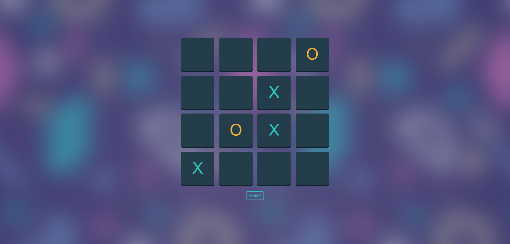

# Dynamic Tic-Tac-Toe Game

## Overview

This is a dynamic Tic-Tac-Toe game developed using JavaScript, HTML, and CSS. The game board is fully responsive to changes in the number of rows, which can be adjusted in the code. This allows for flexible gameplay, supporting various grid sizes beyond the traditional 3x3 board.

## Features

- **Dynamic Board:** The game board adjusts automatically based on the number of rows specified in the code.
- **Responsive Design:** The layout is designed to be visually appealing and user-friendly across different devices.
- **Game Reset:** Includes a reset button to start a new game at any time.

## Links

[Live Version](https://yussif20.github.io/tic-tac-toe_js/)

## Screenshots

### 3x3 Board


### 4x4 Board



## Installation and Setup

1. **Clone the repository:**

   ```bash
   git clone https://github.com/Yussif20/tic-tac-toe_js
   cd tic-tac-toe
   ```

2. **Open the `index.html` file:**

   - You can simply open the `index.html` file in your preferred web browser to start playing the game.

3. **Adjusting the board size:**
   - Open the `script.js` file in a text editor.
   - Locate the section where the number of rows is defined.
   - Change the value to your desired number of rows. For example:
     ```javascript
     const NUMBER_OF_ROWS = 3; // Change this value to adjust the board size
     ```

## Usage

1. Open the `index.html` file in your web browser.
2. Click on any cell to place your mark (X or O).
3. The game will automatically check for a winner or a draw after each move.
4. Click the "Reset" button to start a new game.
